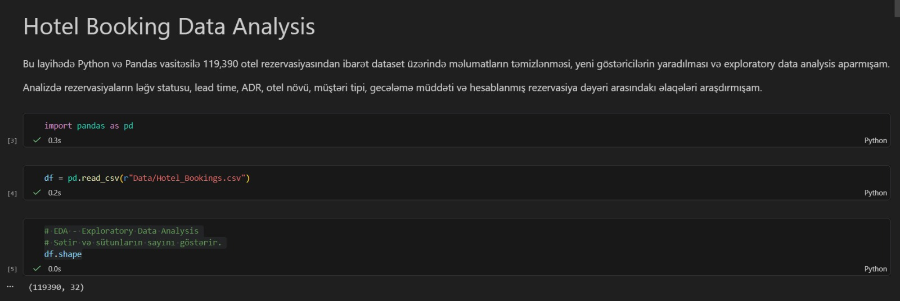
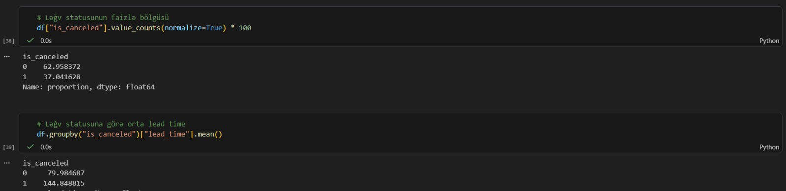
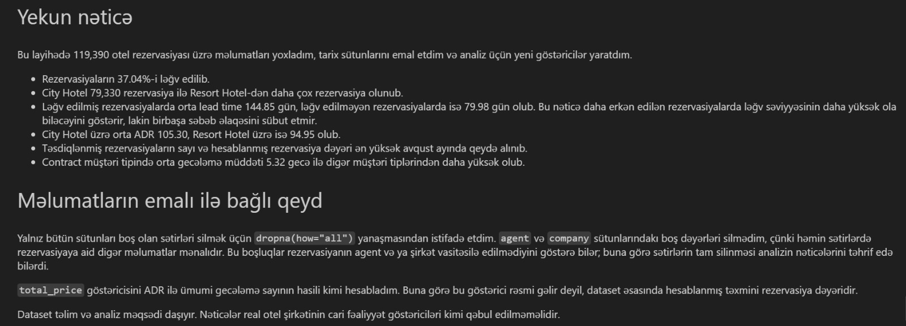

# Hotel Booking Data Analysis

I completed this project to practice an end-to-end hotel booking analysis using Python and Pandas. The source dataset contains 119,390 booking records and 32 original columns.

My goal was to review the quality of the data, prepare the date fields, create useful analytical features, and examine booking patterns related to cancellations, lead time, ADR, hotel type, customer type, and estimated booking value.

## Dataset note

This project uses a dataset provided for training and analysis. It does not represent the current bookings or financial performance of a real hotel company. The findings apply only to the records included in this dataset.

## How I prepared the data

I first reviewed the dataset structure, column types, missing values, descriptive statistics, and duplicate records.

I then:

* Converted `reservation_status_date` from text to a date field
* Combined the arrival year, month, and day columns into one `arrival_date` field
* Created `total_nights` from weekday and weekend stays
* Created `total_guests` from adults, children, and babies
* Derived the arrival month and weekday
* Created `total_price` by multiplying ADR by the total number of nights

I used `dropna(how="all")` so that only rows that were completely empty across all columns would be removed.

I kept the missing values in the `agent` and `company` columns because the remaining booking information in those rows was still meaningful. These missing values may indicate that the booking was not made through an agent or company, so deleting the complete rows could distort the analysis.

The `total_price` field is an estimated booking value calculated from ADR and total nights. It should not be interpreted as verified hotel revenue.

## Questions explored

During the analysis, I examined:

* Booking volume by hotel, country, and arrival month
* The overall cancellation rate
* Average ADR by hotel type
* Confirmed booking volume by month
* Estimated booking value by month
* Average stay length by customer type
* The relationship between lead time and cancellation status

## Key findings

* 37.04% of the bookings in the dataset were cancelled
* City Hotel recorded 79,330 bookings, compared with 40,060 for Resort Hotel
* The average ADR was 105.30 for City Hotel and 94.95 for Resort Hotel
* Confirmed booking volume and estimated booking value were highest in August
* Contract customers had the longest average stay at 5.32 nights
* Cancelled bookings had an average lead time of 144.85 days, while non-cancelled bookings averaged 79.98 days

The lead-time result shows an association between earlier bookings and cancellation status, but it does not prove that a longer lead time directly causes cancellation.

## Project files

* [Jupyter Notebook](./Hotel_Booking_Data_Analysis.ipynb)
* [Dataset](./Data/Hotel_Bookings.csv)
* [Requirements](./requirements.txt)
* [Screenshots](./Screenshots)

## Screenshots

### Project overview

### Cancellation and lead-time analysis

### Key findings

## Tools used

* Python
* Pandas
* Jupyter Notebook
* Visual Studio Code

## How to run the project

Install the required packages:

`pip install -r requirements.txt`

Then open and run `Hotel_Booking_Data_Analysis.ipynb` in Jupyter Notebook or Visual Studio Code.

This project helped me strengthen my practical understanding of data cleaning, feature engineering, exploratory data analysis, and the careful interpretation of relationships between booking variables.

**Yalchin Hasanov**
